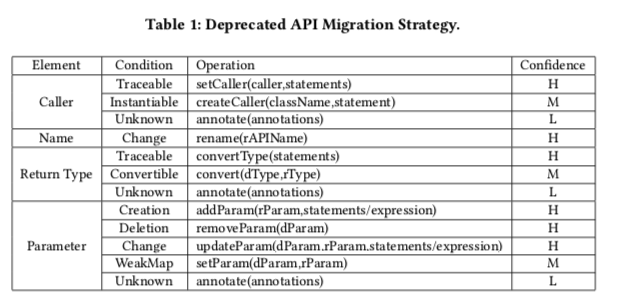

# Migration Strategy Examples



## caller

### Traceable

deprecated API: javax.swing.ScrollPaneLayout.getViewportBorderBounds(JScrollPane scrollpane)</br>
replacement API: javax.swing.JScrollPane.getViewportBorderBounds()


```
    /**
     * Returns the bounds of the border around the specified scroll pane's
     * viewport.
     *
     * @return the size and position of the viewport border
     * @deprecated As of JDK version Swing1.1
     *    replaced by <code>JScrollPane.getViewportBorderBounds()</code>.
     */
    @Deprecated
    public Rectangle getViewportBorderBounds(JScrollPane scrollpane) {
        return scrollpane.getViewportBorderBounds();
    }
```

**The caller of replacement API is $Param1 in deprecated API parameter list.**

### Instantiable

deprecated API: java.util.Date.getYear()</br>
replacement API: java.util.Calendar.get(Calendar.YEAR)

```
    public void getYear(){
        Date date = new Date();
        //int year = date.getYear();
        Calendar calendar = Calendar.getInstance();
        calendar.setTime(date);
        int year = calendar.get(Calendar.YEAR);
    }
```

**We can create an instance of Calendar by invoke Calendar.getInstance().**

## Name

**Just change the name of deprecated API.**

## Return Type

### Traceable

deprecated API: int java.awt.Frame.getCursorType()</br>
replacement API: Cursor java.awt.Component.getCursor()

```
    /**
     * @deprecated As of JDK version 1.1,
     * replaced by <code>Component.getCursor()</code>.
     */
    @Deprecated
    public int getCursorType() {
        return (getCursor().getType());
    }
```
**Cursor -> int. invoker getCursor().getType().**

### Convertible

deprecated API: Object[] javax.swing.JList.getSelectedValues()</br>
replacement API: List<E> javax.swing.JList.getSelectedValuesList

**Object[] -> List. Just invoker Java.util.List.toArray().** 

## Parameter

### Creation

deprecated API: java.lang.ClassLoader.defineClass(byte[],int,int)</br>
replacement API: java.lang.ClassLoader.defineClass(java.lang.String,byte[],int,int)

deprecated API
```
    /**
     * Converts an array of bytes into an instance of class <tt>Class</tt>.
     * Before the <tt>Class</tt> can be used it must be resolved.  This method
     * is deprecated in favor of the version that takes a <a
     * href="#name">binary name</a> as its first argument, and is more secure.
     *
     * @param  b
     *         The bytes that make up the class data.  The bytes in positions
     *         <tt>off</tt> through <tt>off+len-1</tt> should have the format
     *         of a valid class file as defined by
     *         <cite>The Java&trade; Virtual Machine Specification</cite>.
     *
     * @param  off
     *         The start offset in <tt>b</tt> of the class data
     *
     * @param  len
     *         The length of the class data
     *
     * @return  The <tt>Class</tt> object that was created from the specified
     *          class data
     *
     * @throws  ClassFormatError
     *          If the data did not contain a valid class
     *
     * @throws  IndexOutOfBoundsException
     *          If either <tt>off</tt> or <tt>len</tt> is negative, or if
     *          <tt>off+len</tt> is greater than <tt>b.length</tt>.
     *
     * @throws  SecurityException
     *          If an attempt is made to add this class to a package that
     *          contains classes that were signed by a different set of
     *          certificates than this class, or if an attempt is made
     *          to define a class in a package with a fully-qualified name
     *          that starts with "{@code java.}".
     *
     * @see  #loadClass(String, boolean)
     * @see  #resolveClass(Class)
     *
     * @deprecated  Replaced by {@link #defineClass(String, byte[], int, int)
     * defineClass(String, byte[], int, int)}
     */
    @Deprecated
    protected final Class<?> defineClass(byte[] b, int off, int len)
        throws ClassFormatError
    {
        return defineClass(null, b, off, len, null);
    }
```

replacement API:
```
    /**
     * Converts an array of bytes into an instance of class <tt>Class</tt>.
     * Before the <tt>Class</tt> can be used it must be resolved.
     *
     * <p> This method assigns a default {@link java.security.ProtectionDomain
     * <tt>ProtectionDomain</tt>} to the newly defined class.  The
     * <tt>ProtectionDomain</tt> is effectively granted the same set of
     * permissions returned when {@link
     * java.security.Policy#getPermissions(java.security.CodeSource)
     * <tt>Policy.getPolicy().getPermissions(new CodeSource(null, null))</tt>}
     * is invoked.  The default domain is created on the first invocation of
     * {@link #defineClass(String, byte[], int, int) <tt>defineClass</tt>},
     * and re-used on subsequent invocations.
     *
     * <p> To assign a specific <tt>ProtectionDomain</tt> to the class, use
     * the {@link #defineClass(String, byte[], int, int,
     * java.security.ProtectionDomain) <tt>defineClass</tt>} method that takes a
     * <tt>ProtectionDomain</tt> as one of its arguments.  </p>
     *
     * @param  name
     *         The expected <a href="#name">binary name</a> of the class, or
     *         <tt>null</tt> if not known
     *
     * @param  b
     *         The bytes that make up the class data.  The bytes in positions
     *         <tt>off</tt> through <tt>off+len-1</tt> should have the format
     *         of a valid class file as defined by
     *         <cite>The Java&trade; Virtual Machine Specification</cite>.
     *
     * @param  off
     *         The start offset in <tt>b</tt> of the class data
     *
     * @param  len
     *         The length of the class data
     *
     * @return  The <tt>Class</tt> object that was created from the specified
     *          class data.
     *
     * @throws  ClassFormatError
     *          If the data did not contain a valid class
     *
     * @throws  IndexOutOfBoundsException
     *          If either <tt>off</tt> or <tt>len</tt> is negative, or if
     *          <tt>off+len</tt> is greater than <tt>b.length</tt>.
     *
     * @throws  SecurityException
     *          If an attempt is made to add this class to a package that
     *          contains classes that were signed by a different set of
     *          certificates than this class (which is unsigned), or if
     *          <tt>name</tt> begins with "<tt>java.</tt>".
     *
     * @see  #loadClass(String, boolean)
     * @see  #resolveClass(Class)
     * @see  java.security.CodeSource
     * @see  java.security.SecureClassLoader
     *
     * @since  1.1
     */
    protected final Class<?> defineClass(String name, byte[] b, int off, int len)
        throws ClassFormatError
    {
        return defineClass(name, b, off, len, null);
    }
```

**We can determine the new parameter is null.**

